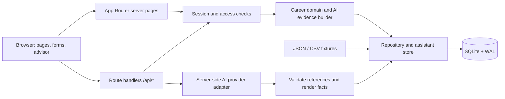

# Architecture

A single Next.js 15 App Router application runs on the Node.js runtime. React 19 components provide interactive forms/chat; Node's built-in synchronous SQLite driver owns persistence. There is no separate backend service, job worker, vector database or ORM.



Server pages read the repository directly; client mutations use route handlers. AI requests are the optional external call. Source datasets are read from disk, not served as public assets.

## Code map

| Area | Responsibility |
| --- | --- |
| [`app/`](../app) | Pages, employee/HR layouts and API handlers |
| [`components/career/`](../components/career) | Planning, development map, catalog controls, reviews, import UI and advisor |
| [`components/shell/`](../components/shell) | Workspace navigation, identity and language controls |
| [`lib/career/`](../lib/career) | Data contracts/import validation, plans, reviews, skill replay, eligibility and navigation guards |
| [`lib/server/database.ts`](../lib/server/database.ts) | Schema initialization, dataset transactions, plans, completions, reviews and sessions |
| [`lib/server/assistant-store.ts`](../lib/server/assistant-store.ts) | Persisted advisor turns and consultation revisions in the same database |
| [`lib/ai/`](../lib/ai) | Context, readiness, provider schema, deterministic presentation and SSE protocol |
| [`lib/i18n/`](../lib/i18n) | Locale parsing, dictionary and date/number formatting |
| [`tests/`](../tests) | Domain tests and isolated HTTP suites |

## Storage model

SQLite stores the small validated dataset as a JSON snapshot, with separate mutable records. It is not a normalized analytics schema.

| Tables | Stored state |
| --- | --- |
| `dataset` | One current JSON payload and monotonically increasing revision |
| `planning`, `planning_actions` | Current plan per employee and actor-attributed before/after saves |
| `demo_completions` | Completion occurrence, command ID, business/operational time and before/after gains |
| `review_scope`, `review_revisions` | Active dataset epoch and immutable review revisions |
| `approved_assessments`, `review_decisions` | Per-skill approved overlays and idempotent human decisions, scoped by epoch |
| `sessions` | Opaque session keys, access role, employee ID and expiry |
| `assistant_turns`, `assistant_consultations` | Evidence/output audit and confirmed preference revisions |

Repository reads overlay current approved assessments and demo completion history onto the imported dataset. Raw employee skill values remain source data. Reset rotates review scope and advances dataset revision; retained audit rows are not exposed as current state. See [reset behavior](getting-started.md#persistence-and-reset).

## Consistency and time

```text
BEGIN IMMEDIATE
  read current revision(s)
  reject stale input
  validate the command against current data
  write state + audit/idempotency record
COMMIT
```

The write lock is acquired before revision checks, preventing two writers from accepting the same stale snapshot. WAL and a 5-second busy timeout support this small single-instance deployment. Synchronous SQLite calls still occupy the Node process; this is not a horizontally scaled design.

Dataset revisions guard imports, completions and approved baselines. Plans have employee-specific revisions; consultation answers are scoped to dataset/plan revisions. Reviews have their own immutable revisions and a scope that survives normal dataset updates but changes on reset. Any dataset change can invalidate advice for other employees too, because the revision is global.

`meta.as_of_date` drives business rules, session availability and default review quarters. The supplied value is `2026-10-01`, so the default completed quarter is `2026-Q3`. Real timestamps record actions and session expiry. Imported CSV `date` is only a completion-time proxy; review evidence includes relevant history beyond the chosen quarter.

## Domain invariants

The implementations are [`skills.ts`](../lib/career/skills.ts), [`eligibility.ts`](../lib/career/eligibility.ts) and [`planning.ts`](../lib/career/planning.ts).

```text
baseline(skill) = latest active approved rating, else imported assessment
next effective level = max(old, min(5, old + gain, activity cap))
module closed = baseline(skill) >= target requirement
coverage = round(100 × closed requirements / all requirements)
```

Replay uses only completed history after the per-skill cutoff and no later than the business date. Demo completions already included in an approval are skipped by ID; later completions remain effective. The `max(old, ...)` prevents a low course cap from reducing assessed competence. No target means nullable target/coverage, not an assumed promotion goal.

Eligibility requires a matching current **or saved target** role/grade pair, prerequisites, no in-progress participation and a future session unless self-paced. Mandatory activities are excluded from voluntary advice/demo completion. Already completed activities are excluded except repeatable `EV_036`; its skill gains still obey caps. Target-only access is a prototype mobility rule, not enrollment authorization.

## Authorization

The public picker issues an eight-hour HttpOnly, SameSite=strict session. The database lookup separates access role from the employee's job role. Secure cookies are controlled by `COOKIE_SECURE`. This is demo impersonation, not production authentication.

| Actor | Allowed scope |
| --- | --- |
| Employee | Own profile, plans, completions, advisor and review drafts/submissions |
| Current direct manager | Own employee capabilities plus direct-report review reads and approval/return |
| HR | All employee inspection, HR advisor, review decisions and dataset import/reset; cannot overwrite employee plans/self-ratings |

Manager access is review-specific: it does not grant the general employee-profile API or advisor access to reports. Self-approval and unrelated-employee decisions are rejected. Server pages and handlers enforce scope; UI visibility alone is not the boundary. Mutations check that the request Origin is HTTP(S) and its host matches the Host header. Shared JSON body reads cap input at 5 MB.

## API map

| Endpoint | Method | Contract/purpose |
| --- | --- | --- |
| `/api/session` | POST form | `accessRole`, optional `employeeId`; `logout=true` ends the session; redirects with 303 |
| `/api/employees/[id]` | GET | Scoped employee, planning, development and history |
| `/api/planning` | POST JSON | `{ datasetRevision, revision, plan }`; employee-owned save |
| `/api/completions` | POST JSON | `{ commandId, eventId, datasetRevision, planRevision }` |
| `/api/reviews` | GET / POST JSON | Read scoped cycles; `create`, `save`, `submit`, `reopen`, `approve`, `return` commands |
| `/api/data` | POST JSON | `preview`, `apply`, `reset`; apply/reset require `revision` |
| `/api/assistant` | GET / POST JSON | Load context or ask in `coach`, `activity`, `hr` mode; optional SSE response |
| `/api/assistant/consultation` | POST JSON | Save confirmed duration/formats/notes with revisions |
| `/api/assistant/goal` | POST JSON | Employee explicitly adopts a persisted AI goal draft |

For completion retries, reuse the same UUID `commandId`; use a new UUID for a new occurrence. Reusing an ID for a different event fails. Review decisions likewise require command IDs and matching command contents. Stale planning/completion/review commands generally return 409; the import handler returns 400 for stale previews. Clients must not assume a uniform error contract. Exact schemas live beside the [handlers](../app/api) and in [review contracts](../lib/career/reviews.ts).

## AI boundary

The server builds scoped source evidence, requests structured output, validates activity/skill IDs, renders factual claims from source records, rechecks revisions, then persists the response. SSE sends status first and validated text/result later, not unchecked raw model tokens. Provider failure is visible; there is no automatic rating, enrollment, completion or goal adoption. See [AI assistance](ai-assistance.md) for context limits and consultation readiness.

## Deployment boundary

The [Dockerfile](../Dockerfile) builds standalone output with fixtures and a non-root runtime. Use one replica, persistent writable database storage and `Recreate` updates. PostgreSQL/MinIO integration, production SSO, distributed locking/rate limiting and external backup retention are outside the current implementation.
