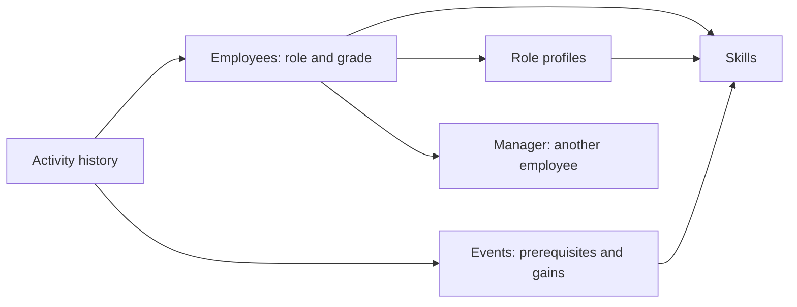

# Career Quest repository context

Analysis date: 2026-09-23. This document records the supplied requirements, data, and starter implementation.

**Current status:** this is the pre-implementation analysis. A cleaned root application now implements the first foundation slice; see [implementation status](implementation-status.md). The original nested checkout is no longer present in the current workspace; starter observations below are historical and their paths are retained as provenance, not live links.

Recommendation: reuse the KMG app's layout and UI primitives, then replace its onboarding domain with Career Quest. The required recommendation engine is not present in the starter.

Latest design priority: dataset-grounded explainability is the product core. Initialization must turn a judge's upload into traceable evidence, and domain changes must keep that evidence current. See [explainability-design.md](explainability-design.md) for feasibility findings and [the next-stage plan](next-stage-plan.md) for work following the delivered foundation.

Confirmed recommendation policy: career goals and critical gaps first. The agent must ask for a missing goal and any material missing context, record attributed answers through validated handlers, and pass an explicit readiness check before recommending. Keep this as one agent and a small persisted state in the prototype.

**Latest product decisions:** [prototype product direction](prototype-product-direction.md) is authoritative for employee-owned arbitrary goals, editable milestone plans (no aggregate readiness percentage), full HR visibility into development records and attributed suggestions, cross-role mobility with transferable skill evidence, and an optional mock assessment path. SAP is inspiration only. Apply role critical gaps when relevant to the chosen goal; do not force every goal into a role/grade. These decisions supersede earlier conflicting proposals and are not yet fully implemented.

The subsequent [quarterly review extension](quarterly-review-requirements.md) adds manager-scoped assessment and a formal grade roadmap with a closed-module count ratio. This is a specific exception to the earlier percentage restriction. Approved ratings, self-ratings and activity-derived skills remain distinct; promotion is a separate human decision. The original brief below remains historical source context.

## Sources and authority

- The Career Quest DOCX in `case_source/` is the current brief. Its Career Quest sections 5–9 define the output, required behavior, jury imports, and constraints.
- [Dataset README](../case_source/case_1/career_quest_dataset/README.md) defines the data contract. The JSON/CSV files are the actual inputs.
- The original `KMG-Hackathon/README.md` described the onboarding demo. Starter sources were inspected during the initial analysis; they are no longer available at that path in this workspace.
- `KMG-Hackathon/ТЗ_Онбординг_KMG_Digital.docx` is the previous project's specification. Its Bitrix, Active Directory, culture nudges, and 90-day onboarding requirements do not apply to Career Quest.
- The supplied brief mentions Voice Router as a separate case. It is outside this plan.

## Required product

Primary user: an employee with roughly 1–5 years of tenure. Secondary user: HR. The brief's central requirement is a useful, explainable development recommendation. Gamification is explicitly optional.

| Requirement | Observable result |
| --- | --- |
| Profile and trajectory | Any employee's role, grade, skills, completed activities, target, and available steps are visible. |
| AI next step | 1–3 relevant development activities. |
| Explanation | At least three relevant factors from grade, skill gaps, participation history, and next-level requirements. |
| Completion | Marking an activity complete changes skill progress and the trajectory. |
| HR view | Common skill gaps, employees without a recommended step, and participation by activity. |
| Jury input | Load additional employee profiles and history in the supplied formats during the demo. |
| Performance | UI response within 2 seconds; AI recommendation within 10 seconds. |
| Reproducibility | Repository, README, and one-command launch. |
| Access | Employee/HR separation; employee engagement data private from other employees. |

The brief forbids single-field rules presented as AI, public employee performance rankings, gamification of mandatory processes, and real personal data. The data is synthetic but the brief restricts taking it outside the hackathon. Keep source data out of public assets and published reports.

Optional: points, rewards, peer recognition, mentoring/team mechanics, challenges, event authoring, attrition prediction, advanced HR analytics, grade-transition simulation, messaging/calendar integration, mobile polish, and full Kazakh/Russian localization.

Scoring: working solution 25, technical implementation 25, README/reproducibility 25, usefulness 15, originality/potential 10. Documentation and a dependable demo deserve a dedicated phase.

## Data actually supplied

| Input | Verified count | Purpose |
| --- | --- | --- |
| `employees.json` | 200 employees | Skills, current role/grade, goal, manager, language, last assessment |
| `events.json` | 40 events | Audience, prerequisites, gains/caps, format, effort, sessions |
| `skills.json` | 60 skills; 32 role profiles | Scale 0–5, requirements for 8 roles × 4 grades, critical skills |
| `activity_history.csv` | 2,743 rows | Completed, active, dropped, missed, declined, overdue participation |

The JSON files are envelopes, not bare arrays:

```text
employees.json = { meta, employees: [...] }
events.json    = { meta, events: [...] }
skills.json    = { meta, proficiency_scale, skills: [...], role_profiles: [...] }
```



Verified data characteristics:

- Snapshot date is **2026-10-01**. History covers **2024-10-01 through 2026-09-30**. Sessions range from **2026-10-05 through 2026-12-25**.
- Grades: 59 Junior, 78 Middle, 47 Senior, 16 Lead.
- Goals: **66 absent**, **28 cross-role**. Ten Leads have no goal. Do not assume everybody is pursuing the next grade in their current role.
- Preferred languages: 100 `ru`, 89 `kk`, 11 `en`. The actual supplied catalog/profile content is English; the READMEs are available in three languages.
- Four mandatory events: `EV_001`–`EV_003` compliance and `EV_004` onboarding. The remaining 36 are voluntary development events.
- History statuses: 2,178 completed, 195 no_show, 160 dropped, 104 declined, 90 overdue, 16 in_progress.
- Optional CSV cells are genuinely blank: 1,519 due dates, 1,420 scores, 1,847 ratings. Blank must not become a score/rating of zero.
- Checked uniqueness of employee/event/skill/history IDs, employee roles/goals/managers, skill references, and history references. These checks passed. This is not a complete audit of every generator invariant.

## Rules that affect the architecture

1. **Use the dataset clock.** `meta.as_of_date` is the business date. Wall-clock time remains suitable for operational logs and latency measurements.
2. **Preserve assessed skills.** `employees.skills` is the last assessment, not an initial career baseline. Only completed activity after `last_review_date` contributes additional gains.
3. **Treat absent skill entries as zero.** Apply the full role requirement set when calculating gaps.
4. **Never lower a skill when applying an event cap.** A participant may already exceed an event's `max_level`.
5. **Filter before ranking.** Mandatory status, role/grade audience, prerequisites, session availability, prior completion, and active participation affect eligibility.
6. **Handle repeatability and source conflicts.** The README says completed events cannot repeat except `EV_036`, Public Speaking Club. Actual history also repeats annual mandatory events `EV_001`–`EV_003`: 458 employee/event pairs have multiple completed records. Preserve these historical records; distinguish the documented voluntary recommendation rule from the mandatory-history discrepancy.
7. **Keep critical gaps visible.** A high average does not eliminate an unmet critical skill requirement.
8. **Use history as evidence.** Repeated no-shows/dropouts matter, but do not justify excluding a person from all future development.
9. **Separate access role from job role.** The starter's `role: "hr" | "employee"` conflicts with dataset roles such as `Backend Engineer`. An HR Business Partner profile is not automatically an HR administrator.
10. **Keep manager relationships intact.** Dataset `manager_id` references an employee, usually a department Lead. It does not identify an HR account as in the KMG seed.

Read-only exploration found 318 completed rows dated after the employee's review, affecting 133 employees. Of these, 139 are self-paced rows. Applying their gains can encounter an existing level above the event cap; this occurred in 11 gain applications.

**Source ambiguity:** CSV `date` is a session date, or enrollment/assignment date for self-paced events. There is no historical `completed_at`. Exact completion-time replay is therefore impossible for self-paced history. Proposed fallback: use `date` as the documented historical proxy, and record a separate completion timestamp for new actions. Do not imply this reconstructs exact historical completion dates.

An exploratory eligibility pass using that proxy, current role/grade, prerequisites, future availability, completion exclusions, and active-event exclusions found five employees whose remaining events offer no positive skill gain (`E0044`, `E0093`, `E0133`, `E0148`, `E0185`). This is a useful empty-state fixture, not a finalized recommendation result or evidence that those people are disengaged.

## Starter architecture

```text
Next.js App Router
  RootLayout
    StoreProvider: entire PortalState in the browser
      PreferencesProvider: locale/theme in localStorage
        AppShell: client-side role redirect
          Sidebar + TopBar + employee DigitalBuddy overlay
          Pages reading useStore()

Browser persistence: kmg.onboarding.portal/v1
AI request: browser -> /api/chat -> Groq
AI fallback: browser -> lib/rag.ts -> seeded knowledge articles
```

| Area | Observed implementation |
| --- | --- |
| Stack | Next 15.1.3, React 19.0.0, TypeScript, Tailwind 3, Radix primitives, Lucide icons |
| Routes | 32 pages: root + 16 employee + 15 HR; one API route, `/api/chat` |
| State | React Context/useReducer; `lib/store.tsx` is 984 lines; 39 files import `@/lib/store` |
| Persistence | One localStorage state blob containing all demo users and business data |
| Accounts | 2 HR + 3 employees; selecting an account is the entire sign-in flow |
| Domain | Tickets, flow nodes/tasks, a 90-day onboarding schedule, course sections/quizzes, messages, feedback, badges |
| Catalog | Six hard-coded KMG courses in `lib/courses.ts` |
| UI foundation | Reusable cards, buttons, dialogs, progress bars, tables, responsive shell, SVG charts |
| Backend | Next API route for chat; no application database, server session, or data import |
| Python | Three standalone AI/badge/sentiment scripts; no frontend call to a Python service found |
| Verification setup | `typecheck`, `build`, `lint` scripts; no automated tests, CI workflow, Dockerfile, or Compose file found |

### Reuse limits

- Types (`KMG-Hackathon/lib/types.ts`): `User` has no grade, skills, review date, or career goal. `ActivityEvent` is an audit-feed message, not a dataset participation record.
- Store (`KMG-Hackathon/lib/store.tsx`): course completion updates sections, notifications, onboarding items, and logs. It has no skill-gain or career-progress calculation.
- AI route (`KMG-Hackathon/app/api/chat/route.ts`): accepts a question, keyword-ranks culture cards, and prompts a KMG policy assistant. It receives no employee profile/history/grade requirements. Changing its branding cannot turn it into the required recommender.
- App shell (`KMG-Hackathon/components/shell/app-shell.tsx`): access checks redirect in the browser. All users' data remains available in browser state. This does not meet server-enforced privacy.
- Sentiment (`KMG-Hackathon/lib/sentiment.ts`): metrics are pseudo-random values seeded by user ID, rather than analysis of participation or messages.
- HR reports (`KMG-Hackathon/app/hr/reports/page.tsx`): mixes ticket-derived metrics with fixed deltas and `state.activity.length * 3` for RAG volume. Reuse chart rendering, replace metric definitions.
- Document upload helper (`KMG-Hackathon/lib/store.tsx`): `addVectorDoc` saves metadata only. It neither reads a document nor changes AI context. It cannot serve as the jury import workflow.
- Locale/theme support exists, but many pages contain hard-coded Russian text. Three language options do not mean complete localization.

## Repository and verification status at initial analysis

- Outer repository has one commit, `fb60056`, and a short README. At analysis start, `KMG-Hackathon/` and `case_source/` were untracked in it.
- `KMG-Hackathon/` is a clean nested Git repository at `2cc991e` with 120 tracked files. Preserve provenance before deciding how to bring its files into the team repository. A casual `git add KMG-Hackathon` risks recording a gitlink instead of the application source.
- The copied source includes `.DS_Store` and a Word `~$` lock file. Exclude those from the eventual project import.
- No app `node_modules` or `.next` was present. No dependency install, app launch, typecheck, build, live LLM request, or browser review was performed in this analysis.
- Requirements were read via DOCX text extraction. Source JSON/CSV files were parsed and the checks above were executed. No application or dataset files were modified.
- Existing documentation's dependency upgrade advice is historical. A supported dependency version and working lint command need verification when establishing the implementation baseline.
