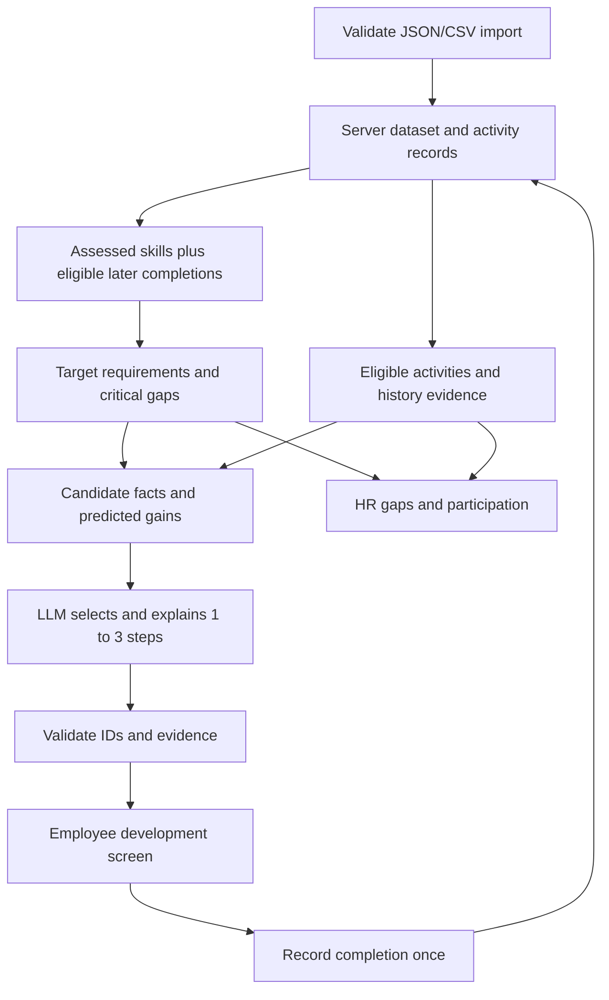

# KMG starter trimming plan

Reduce the starter from **32 page routes to 6**, keep its UI foundation, and implement the Career Quest domain separately. **Implementation update (2026-09-23):** the six-route foundation now lives at the repository root; see [implementation status](implementation-status.md). The original checkout remains untouched as a local-only reference, per the user's instruction. The proposed path and sequencing below describe the original plan; the root-app decision supersedes them.

The [repository context](repo-context.md) records the requirements, verified dataset details, and limitations of the existing app.

**Product update:** [prototype product direction](prototype-product-direction.md) supersedes earlier scope assumptions: arbitrary employee-owned goals, editable milestone plans, full HR development-record visibility and suggestions, cross-role mobility, and optional mock assessments. SAP integration is not a prototype dependency. The route layout below is still a proposal; the new product behavior is not yet implemented.

**Design checkpoint before execution:** the latest direction makes explainability and dataset initialization the core. Follow the agreed readiness loop in [explainability-design.md](explainability-design.md): imported profile → inspect requirements → ask for missing goal/material context → validate state updates → traceable recommendation → recorded completion → revised explanation. Prioritize career goals and critical gaps. The route reduction remains a proposed destination; the implementation sequence below must be revised around that proof before trimming starts.

## Target routes

| Route | Purpose | Reuse |
| --- | --- | --- |
| `/` | Compact demo entry, employee selection, HR entry | Replace the KMG marketing landing; keep layout primitives |
| `/employee/dashboard` | Profile, arbitrary goals, editable milestones, relevant skill gaps, recommendations, history and evidence | Rewrite content inside the existing shell |
| `/employee/learning` | Development activities, prerequisites, sessions, participation, completion | Reuse catalog/card layout; replace the course engine |
| `/hr/dashboard` | Skill gaps, participation, missing-step reasons, searchable employee list | Merge useful table/chart layouts from dashboard, employees, and reports |
| `/hr/employees/[id]` | HR inspection of the full employee development record and attributed recommendations | Share development/evidence panels; employee retains ownership of the adopted plan |
| `/hr/data` | Validate/import jury profiles and history, show dataset date/counts, reset demo | New route; an actual JSON/CSV importer |

Activity details can be a dialog on the catalog page. Goals, milestone editing, history and evidence can be sections on the employee dashboard. Conversational clarification can be embedded there; no separate chat, graph editor, settings, reports or course-player route is needed for the required demonstration.

This removes 27 existing pages, adds one import page, and retains five route paths. The net reduction is 26 pages, approximately 81%. It is not an estimate of code reduction or effort.

## Keep, simplify, replace, remove

| Area | Decision | Concrete scope |
| --- | --- | --- |
| Next/React/TypeScript/Tailwind | Keep | Keep one application/runtime and the current app directory during the first pass |
| `components/ui/*` | Keep as used | Prune unreferenced primitives only after the six routes work |
| `components/charts/*` | Keep as used | Use real skill and participation aggregates as chart inputs |
| `components/shell/*` | Simplify | Short navigation; remove global search, notification tray, assistant banner, settings/profile links |
| `components/providers/preferences.tsx`, `lib/i18n.ts` | Simplify | Retain a small locale/theme mechanism if used; strip old messages; no localization expansion in the first cut |
| `components/brand/logo.tsx`, metadata, visible text | Replace branding | Career Quest/BizAI naming; remove KMG claims and fake headline metrics |
| `lib/types.ts`, `lib/seed.ts`, `lib/store.tsx`, `lib/storage.ts` | Replace | Dataset contracts, server data access, small session/UI state; retire the giant browser business store |
| `app/api/chat/route.ts`, `lib/rag.ts` | Replace | Structured recommendation endpoint and provider adapter; remove KMG prompt/culture retrieval |
| `components/flowchart/*`, `lib/flow.ts` | Remove | Ticket flows are not career trajectories; use skill bars and a simple grade strip |
| `components/buddy/*`, `lib/buddy.ts`, `lib/program.ts` | Remove | Mascot, tutorial, welcome video, nudges, first-day gates, day overrides, 90-day schedule |
| `lib/courses.ts`, `lib/media.ts` | Remove | KMG course content, quizzes, embedded videos; dataset events become the catalog |
| `lib/sentiment.ts`, sentiment card | Remove | Synthetic engagement/anxiety figures do not satisfy this case |
| `components/shared/*` | Remove after consumers move | Current shared components implement tickets, chat, calendar, sentiment, welcome, and notifications |
| `ai-module/` | Exclude from active app | Python scripts, sample documents, SQL nudge data, badge tooling are outside Career Quest |
| `public/buddy/`, `public/badge-samples/` | Remove | Old branding and badge/demo assets |
| Old KMG DOCX and stale `CLAUDE.md` content | Archive/update | Preserve original in source history; make active documentation describe Career Quest |

Mentoring events remain valid catalog activities. Removing the dedicated 1:1 messaging/meeting feature must not remove events with `type: "mentoring"`.

Mandatory activities remain in the imported history and can be displayed. Exclude them from voluntary recommendations and rewards; do not discard those records during import.

### Routes to retire

```text
employee/assistant       employee/calendar       employee/documents
employee/feedback        employee/help           employee/journey
employee/knowledge       employee/learning/[courseId]
employee/mentorship      employee/profile        employee/settings
employee/tasks           employee/team           employee/tickets/[id]

hr/assistant             hr/badge                hr/calendar
hr/documents             hr/employees            hr/knowledge
hr/learning              hr/mentorship           hr/profile
hr/reports               hr/settings             hr/tickets
hr/tickets/[id]
```

### Dependency cleanup

- Remove `@xyflow/react` after the final flowchart import is gone.
- `zustand`, `date-fns`, and `@radix-ui/react-toast` are declared but no source imports were found. Remove them in the baseline cleanup if that remains true.
- Retain React, Next, Tailwind, Lucide, `clsx`, `tailwind-merge`, `class-variance-authority`, and Radix packages used by retained components.
- Regenerate the lockfile with package tooling. Do not hand-edit transitive dependencies.
- Verify supported framework versions and lint configuration at baseline time; do not blindly apply the old `CLAUDE.md` patch-version advice.

## Proposed application boundary

Use the existing Next server for imports, recommendation requests, completion writes, and HR queries. A small SQLite database is the proposed persistence for a single-instance hackathon deployment. Keep that choice behind a repository interface until the hosting target is known. No separate Python service or vector database is justified by the supplied structured dataset.

```text
KMG-Hackathon/
  app/                         six pages + API handlers
  components/
    ui/                        retained primitives
    shell/                     reduced navigation/layout
    career/                    profile, gaps, recommendations, activities
    charts/                    only charts used by HR
  lib/
    career/
      types.ts                 dataset and result contracts
      import.ts                parse, validate, normalize, merge
      skills.ts                effective skills, targets, progress
      eligibility.ts           candidate filtering and exclusion reasons
      recommendations.ts       evidence assembly and ranking orchestration
      analytics.ts             HR aggregates
    server/
      repository.ts            server-only persistence
      session.ts               actor identity and access policy
      llm.ts                   provider request, timeout, output validation
    utils.ts                   retained presentation utilities
```

Keep input files in `case_source/` as source fixtures. Load them on the server using a configured dataset directory; do not place them in `public/` or import the complete employee dataset into a client component. The eventual root launch command should include the dataset in its build/runtime context.

The browser should hold presentation state and authorized API results. Old KMG localStorage state is incompatible; ignore it using a new preferences namespace rather than attempt an onboarding-state migration.

Use a server session with a separate `accessRole` and `employeeId`. Employee queries/writes are scoped to that identity; HR routes are checked on the server. The demo may offer account selection, but that remains explicitly demo authentication. Do not claim production identity verification from a role picker. A production identity provider is deferred.

## Core computation to build after the cut



### Skill progress

```text
effective skills = assessed skills + completed post-review event gains
new level        = max(old level, min(5, old level + gain, max_level))
gap              = max(0, target requirement - effective level)
```

The outer `max` prevents a lower event cap from reducing an already higher skill. Recompute from an immutable assessment plus activity records, in date order, rather than repeatedly mutating the assessment. A duplicate completion request must not add the gain again.

Use `record.date > last_review_date` for historical replay with the documented self-paced date limitation. New participation records should retain a separate completion timestamp internally without changing the accepted input schema. A repeated club attendance is a new participation/session; a repeated click on the same completion is not.

Use milestone outcomes, explicit success criteria, evidence and states instead of an aggregate readiness percentage. Show per-skill levels/gaps where relevant and keep critical requirements visible. Personal milestone completion is attributed; it does not grant a skill level. The earlier skill-coverage percentage proposal is superseded. Preserve imported course `completion_pct` as source data.

### Goals and eligibility

- Preserve an explicit imported `career_goal`, including role changes, and allow employees to create arbitrary free-form goals in application-owned state without changing the jury import schema. Role/grade mapping is optional; employees can choose the goal to focus on.
- Without a goal, ask the employee before making targeted recommendations. Show `awaiting_answer` and a persisted missing-goal blocker. Use a valid imported goal without re-asking unnecessarily; do not invent a higher grade for Leads.
- Support cross-role exploration and transferable skill evidence. Proposed mobility policy: evaluate the catalog audience against the current role/grade or an explicitly selected target role/grade, and disclose target-context eligibility as a prototype policy extension. Preserve original audience fields and continue enforcing real skill prerequisites and other constraints. Details are in the product direction; the existing current-role-only code still needs updating.
- Reject mandatory events, unmet prerequisites, incompatible audiences, already completed non-repeatable events, and scheduled events without a future session.
- Present in-progress participation as a continuation, not a fresh enrollment. Exclude it from the new-activity recommendation pool.
- Prioritize contribution to the employee's chosen goal and milestones, including critical gaps for role-linked goals, among feasible activities. History, effort and preferences refine the choice. Include prerequisite-building steps when they open a documented path. Do not fill three cards with zero-benefit options merely to reach a count.
- Let employees change, reorder, pause or remove proposed milestones/actions. Explain resulting dependency changes and preserve the edits. Keep HR/AI suggestions distinct from the adopted plan and from verified evidence.
- If nothing useful remains, return a reason such as `goal_unset`, `target_covered`, `prerequisites_unmet`, or `catalog_gap`. HR should distinguish these from an AI request that has not run or has failed.

### Explainable AI

Deterministic code supplies eligibility, numeric gaps/gains, critical requirements, and history evidence. The LLM compares eligible candidates, selects up to three, and explains tradeoffs. This gives the AI a decision role while keeping eligibility and arithmetic verifiable.

Before selection, the agent checks a code-defined readiness contract. It asks focused questions for missing goals or material context, stores attributed answers through validated handlers, and recomputes candidate evidence. Pause for answers and explain unresolvable blockers; do not generate recommendations based on invented defaults or a self-assigned confidence score. The internal state is a small persisted decision object, not an agent-editable copy of employee facts.

Each result should reference actual event IDs, predicted skill deltas, and evidence for at least three relevant factors. Use participation records for claims about repeated misses, completion, format preference, or ratings; sparse history should be acknowledged rather than embellished. Do not claim a voluntary event was completed on time when no deadline/completion timestamp supports it.

Reject unknown event IDs, duplicate selections, and unsupported numerical evidence. Imported free text is data, not instructions. Derive displayed skill arithmetic from the server rather than trusting model-generated numbers.

Limit each AI response so it fits the 10-second budget; waiting for a person's answer is a separate conversational state, not an endlessly running request. Fetch profile and HR data independently to meet the 2-second UI target. Cache by dataset/employee-history/goal/self-report/model-prompt version and invalidate affected results on import, answers, and completion. Avoid 200 LLM calls on every HR dashboard load.

If the LLM is unavailable, expose the failure and optionally show an explicitly labeled rules-based suggestion. Do not silently present a deterministic fallback as an AI recommendation.

### HR metrics

- Skill gap prevalence: count deficient employees among employees whose selected target requires that skill. Show numerator and denominator, with current-grade gaps distinguished from target-grade gaps.
- Missing next steps: show computed reason, plus separate states for not generated and AI failure.
- Participation: counts by event and status, filterable by voluntary/mandatory activity and period. Attendance, completion, and decline are distinct measures.
- Development inactivity: if added to satisfy the brief's disengagement use case, show a transparent participation window and counts. No inferred anxiety or attrition score is needed.

## Ordered implementation phases

| Phase | Changes | Exit condition |
| --- | --- | --- |
| 0. Reproducible baseline | Preserve starter commit/provenance; decide normal-directory import versus a properly configured submodule; exclude OS/Word lock files; install from lockfile; inspect lint/build/toolchain behavior | Clean checkout launches; baseline failures recorded exactly; app source will be present in a teammate's clone |
| 1. Trim routes and shell | Keep the five existing target paths, add the import route; remove unused navigation, Buddy, notifications, search, marketing metrics; retire 27 routes | Every retained route opens and every visible link resolves; no onboarding popups |
| 2. Replace the shared domain | Implement input contracts/import, server repository/session, effective skills, and minimal target screens; move retained pages off old `useStore` | All 200 profiles render with real role/grade/skills/history; jury-format import works; employee API scope enforced |
| 3. Remove legacy internals | After the last consumer moves, delete old store/types/seed/storage, KMG libraries, shared components, Python module/assets, flowcharts, unused dependencies, old CSS/text | No active imports or links to deleted modules; typecheck/build pass; no KMG business data in client bundles |
| 4. Close the required product loop | Add multi-factor AI recommendations, validated completion writes, recomputed trajectory, real HR aggregates | Profile → explanation → complete → skill delta → refreshed recommendation/HR view works |
| 5. Make the jury demo dependable | Add focused domain/access/import checks, one-command launch, reset path, README, failure states, latency measurements | Fresh launch and unseen-profile demo succeed with known limitations stated |

Phases 1–3 are the trimming work. Phases 4–5 turn the trimmed foundation into the required submission. Keep phase 2 buildable by adding new domain modules alongside the old ones, then migrating retained pages before phase 3 deletion. Do not leave placeholders described as finished features.

Proposed launch contract from the repository root, after environment setup: `docker compose up --build`. Package one Next service with the input dataset and a persistent data volume. Containerization is to be added in phase 5; this command does not exist in the current repository.

The first implementation slice should end after phases 1–3: a small, working app using real dataset profiles, ready for recommendation work. Avoid simultaneously moving the application directory or redesigning the visual system.

## Validation that matters

1. Import additional profiles/history using the original envelopes and CSV columns. Preview counts/errors; merge employees by `employee_id` and history by `record_id`; reject conflicting duplicates or explicitly replace a dataset. Re-import must not duplicate participation. Validate all references against the resulting combined dataset before committing it atomically.
2. Preserve skill baselines across reload/import. Test review cutoff, absent skills, caps below current levels, and blank numeric cells.
3. A repeated completion is idempotent; two distinct `EV_036` attendances are allowed. Completion changes the relevant gaps and invalidates stale recommendations.
4. In an adversarial profile, repeated speaking no-shows and a critical System Design gap must affect selection. A lowest-skill-only rule should fail this test.
5. Handle absent goals, cross-role goals, Leads, completed catalogs, in-progress events, and no useful candidate without fabricated recommendations.
6. Tampering with an employee ID cannot read another employee's data, query HR analytics, import data, or write another employee's completion.
7. Handle AI timeout, invalid output, and missing configuration visibly. Measure UI and AI latency separately against the brief's limits.
8. Smoke-test the six routes, import → inspect → recommend → complete → HR sequence, and persistence after restart. Run typecheck/build after each meaningful implementation phase.

## Assumptions and deferred choices

- Scope is Career Quest MVP, using the starter UI as a starting point. Implementation was authorized on 2026-09-23; the first foundation slice is implemented at the root.
- Six routes remain a design proposal, not a prescribed requirement. Milestone-based progress replaces the earlier aggregate skill-coverage indicator by explicit user direction.
- SQLite assumes one server instance with persistent disk. Change the repository adapter if the eventual host requires another persistence model.
- Historical completion time is unavailable for self-paced rows. The `date` proxy must be documented in the app/README where progress is explained.
- Provider choice is open. The existing server-side Groq request pattern can be reused, but availability, model support, latency, and hackathon data-handling conditions must be checked before a live integration. No source data was sent to an external model during analysis.
- Full localization, gamification, calendar integration, course authoring, and production SSO remain later work. None should delay the required recommendation and progress loop.
