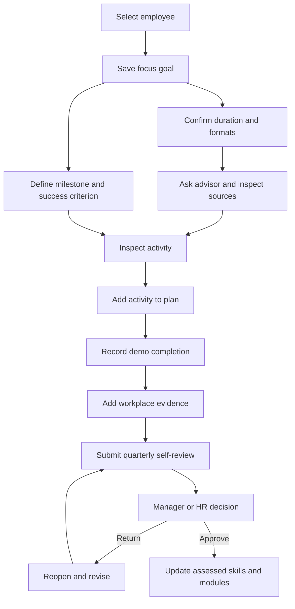
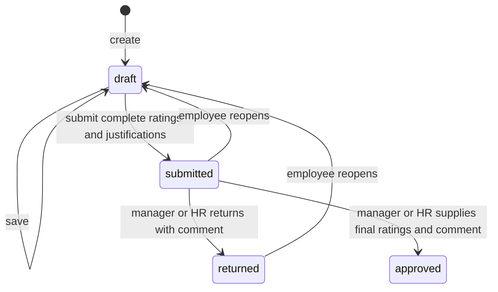

# User flows and demo walkthrough

Use synthetic data in an isolated database if you intend to import, complete activities or reset. See [setup](getting-started.md). Paths below are relative to the running app. Changing accounts uses the public entry flow; managers do not have a separate login role.

Advisor use is optional for manual planning and catalog exploration. Live recommendations require a configured provider. Approval changes assessed skills, not the employee's recorded grade.

## 1. Employee: choose a direction

1. Select an employee on `/`; open `/employee/dashboard?view=plan`.
2. Keep/edit an imported goal or add a free-form outcome. Set one goal as the focus.
3. For catalog recommendations and quarterly reviews, map the focus to an available role/grade profile.
4. Add a milestone with an outcome, success criterion, actions and optional evidence. Save.
5. Reload the plan to verify persistence; inspect `/employee/dashboard?view=skills` for target requirements.

Expected: a free-form goal without a mapping remains valid, but has no target coverage. A next-grade preview is only a draft until saved. Milestone edits do not change skill levels.

## 2. Employee: get advice and choose learning

1. Open `/employee/dashboard?view=advisor`.
2. Confirm maximum total hours per activity and acceptable formats in preferences. Confirm explicitly even if unrestricted; optional notes are not deterministic filters.
3. Ask for a next step. Inspect the cited gaps, activity facts and prospective gains.
4. If offered a goal draft, adopt it explicitly, then reconfirm preferences for the changed plan before asking for recommendations.
5. Open a suggested activity, or browse `/employee/learning` manually. Search and inspect eligibility reasons, prerequisites, caps and sessions.
6. Add an activity to the plan, then return to the plan to edit its outcome and success criterion.

Expected: no provider key/failure produces a visible fallback. An unmapped target or empty eligible catalog result blocks recommendations rather than inventing them. HR advice cannot adopt an employee's goal.

## 3. Employee: record learning and evidence

1. Open an eligible activity in `/employee/learning`.
2. Use its demo completion control and inspect the recorded before/after skill levels.
3. Open Skills & strengths: effective levels can improve while formal modules remain unchanged.
4. Return to My plan, record evidence against the milestone's success criterion, and update/save the milestone state yourself.
5. Reconfirm preferences and ask for updated advice after the dataset change.

Expected: completion is persisted with a real timestamp and the synthetic business date. Most completed activities become ineligible; `EV_036` can repeat with gains capped by catalog rules. API clients reuse the same completion UUID after a failed network response, but use a new UUID for a new occurrence. Completion is a demo action, not a learning-platform certificate.

## 4. Employee: submit a quarterly review

1. Save a focus linked to an available role/grade with required skills.
2. Open `/employee/reviews`, choose a completed quarter and create its review. With supplied fixtures the default is `2026-Q3`.
3. Enter an integer self-rating from 0–5 and a business justification for each required skill. Partial drafts can be saved.
4. Submit after every required item is complete.
5. Inspect the frozen submission. To revise a submitted or returned review, reopen it, edit, and submit again.

Expected: requirements/scale are captured at creation; submission freezes evidence and self-ratings in an immutable revision. Relevant evidence can predate the quarter, so inspect dates before treating it as period-specific proof. An approved review cannot be reopened through the current command path.

## 5. Manager or HR: make a human decision

1. As a manager, enter your normal employee account and select a direct report at `/employee/reviews`. As HR, search the employee at `/hr/dashboard`, open their profile, then `?view=reviews`.
2. Read the submitted self-ratings, justifications and frozen evidence. AI calibration is marked as not run.
3. To approve, enter an explicit final rating for every skill and a comment. To return, enter a comment explaining what needs revision.
4. Submit the decision. Inspect the resulting status and, after approval, the employee's assessed levels/module coverage.

Expected: only HR or the **current direct manager** can decide. The employee cannot approve their own review. A return changes no assessment; approval writes only the reviewed skill baselines and does not change grade. If assessments changed since submission, the employee must resubmit against current evidence before approval.

## 6. HR: inspect and import

1. Enter HR and search profiles at `/hr/dashboard`. Inspect participation summaries and target-gap prevalence.
2. Open a profile to inspect plans, skill evidence, history and reviews. Use the HR advisor for discussion preparation; employee plans remain read-only.
3. Open `/hr/data`, select employee JSON and/or history CSV, then preview.
4. Resolve validation/conflict errors, apply the current preview, and locate the imported employee/history.
5. If demonstrating reset, explain that it restores fixtures and removes current plans/completions before activating it. Old review/advisor audit records are retained outside current context.

Expected: identical imports do not duplicate records; conflicts do not partially apply. Reset is not a full database wipe. See [import instructions](getting-started.md#import-instructions) for limits and retained state.

## Manual acceptance checklist

- Saved plans and review drafts survive reload.
- Cross-employee profile access is denied; direct managers can inspect only authorized report reviews.
- A completion changes effective skills without claiming assessment approval.
- Returned reviews can be revised; approved reviews update baselines without promotion.
- Plan/data changes invalidate stale advice; provider failure is visible.
- All three languages keep IDs and imported free text intact. Save before switching language: it reloads the page and loses unsaved edits.
- Desktop/mobile navigation, keyboard form use and widget visibility remain usable.

These are walkthrough instructions, not results from a new browser test run.
